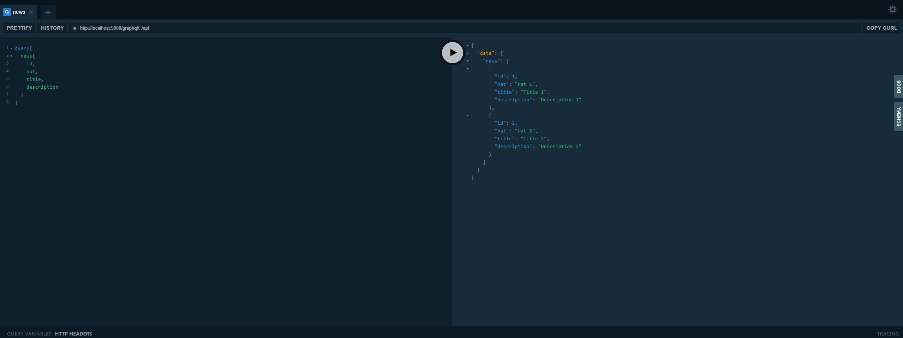
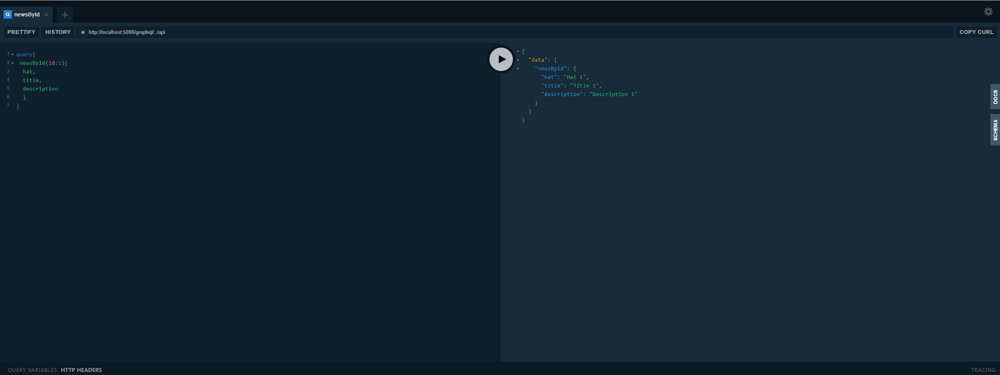

# GraphQL .NET

 This Visual Studio template can helps you to create a Simple structure using GraphQL and .NET with two routes GetAll and GetById.

## GetALL

## GetById

This project is [open source on GitHub](https://github.com/programadriano/template-graphql-dotnet) and we welcome everybody who wants to contribute.
